---------

Empezamos con la resolución de la máquina, haciendo un **ping** para comprobar si tenemos conexión:

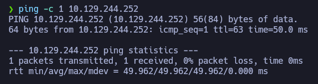

Podemos ver que hay conexión, enviamos un paquete y recibimos un paquete.

El siguiente paso es **escanear los puertos abiertos** de la máquina víctima para ver por donde podemos entrar, para ello usamos _nmap_ para primero hacer un escaneo sencillo:

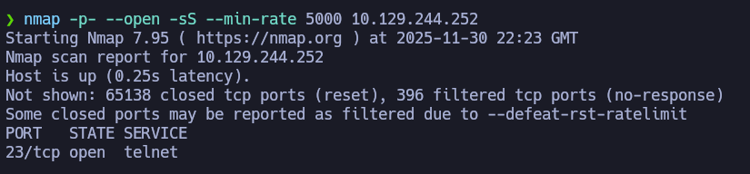

Esto es raro, porque solo hay un solo puerto abierto, se trata del **puerto 23** y ademas tiene el servicio **telnet** abierto que no se destaca por ser seguro. 

Decidí escanear este puerto con más profundidad, pero no encontré nada interesante, ni siquiera la versión exacta del servicio:

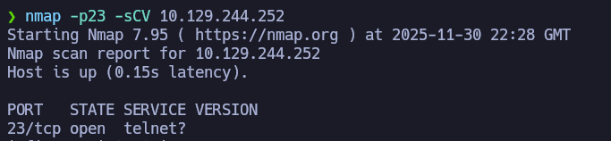

Un detalle curioso es que después de realizar este segundo escaneo, encontré esto: 

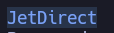

Intenté conectarme vía **telnet** con la máquina:

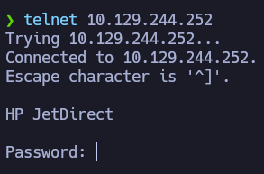

De primeras  estuve en plan *F en el chat* porque no tenía ninguna contraseña para ingresar, pero se podía ver **HP JetDirect**, que resultó ser algún dispositivo raro o modelos de impresora: 

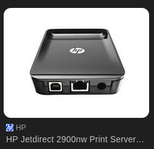

Estuve buscando credenciales por defecto y encontré esta respuesta por parte de la IA de Google: 


Aunque tenía usuarios por defecto, no encontré contraseñas por defecto, así que decidí probar a escanear los puertos por vía **UDP**: 

(Recomiendo usar el parámetro *--top-ports 100*, de lo contrario se tarda **muchísimo**)

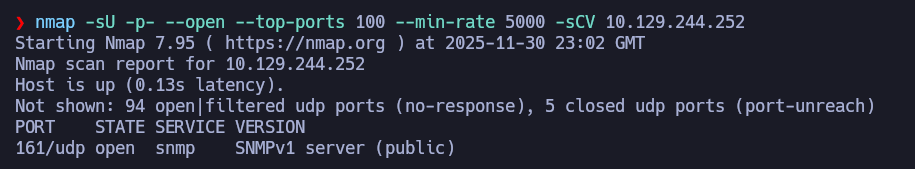

El puerto abierto resultó ser el **161** y tiene abierto el servicio **SNMPv1**, este servicio se le conoce como **Simple Network Management Protocol**, y su función es **monitorizar y administrar dispositivos de red**, si este servicio está mal configurado puede volver una mina de oro en cuanto a información del equipo. 

La herramienta que usé para darme un paseo por esta máquina fue el **snmpwalk**, y el comando completo es este:

```bash
snmpwalk -c public -v2c "ip"
```

Con este comando le estamos diciendo a la máquina: **dame toda la info SNMP que tenga esta máquina**. 

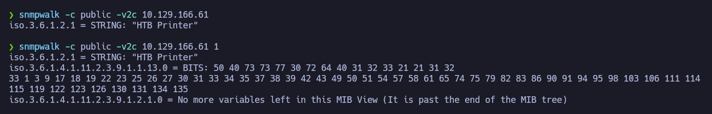

Estos 2 comandos de la imagen nos muestran información, este primero comando nos muestra el nombre de la impresora **HTB Printer**:

```bash
snmpwalk -c public -v2c 10.129.166.16
```

Este segundo comando nos muestra más información definida en *bits*,  a parte de que nos muestra mucha más información que el primer comando:

```bash
snmpwalk -c public -v2c 10.129.166.61 1
```

Esos *bits* que se nos muestran en la salida del comando significan algo, pero no tengo ni puta idea de que es, así que usé este comando para ver los valores en formato letra: 

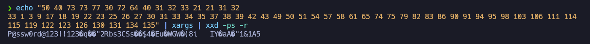

Usé **xargs** para que la salida del comando se me colocara toda en una sola línea, sin espacios ni saltos de linea

Usé **xxd -ps -r** para que agarre la lista de valores en hexadecimal y los convierta de vuelta a sus caracteres originales, mostrándolos como una cadena de texto.

El resultado fue una contraseña bastante larga, esta misma contraseña la probé cuando volví a intentar iniciar sesión vía **Telnet**: 

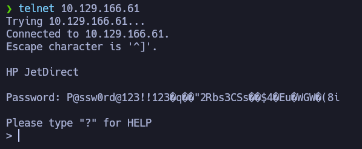

Ya estamos dentro de la máquina:

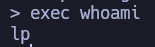

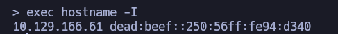

Aún usando **Telnet** para estar dentro de la máquina, pude ver la primera flag:

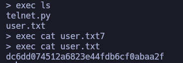

Como no quería tener que ejecutar todos los comandos con *exec* y quería algo más de libertas, me lancé une reverse shell: 


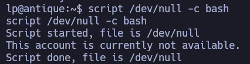

Por algún motivo,  me apareció el mensaje de "*This account is currently not available*", al tratar de hacer un tratamiento de la tty, la terminal casí que se corrompió:

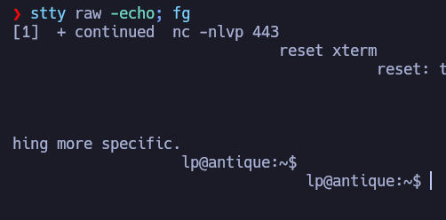

Así que decidí comprobar si Python estaba instalado en la máquina:


Pues Python estaba instalado, así que me puse en una terminal desde la propia máquina: 


Una vez dentro, revisé las dimensiones de la tty, y me di cuenta de que estaba en un puñetero rectángulo:

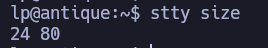

Lo dimensioné a mi escala real:


Una vez dentro ejecute estos comandos para hacer un pequeño tratamiento de la tty, y para que nada explotara:

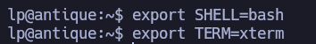

En este punto faltaba poder escalar privilegios a usuario **root** del sistema, para eso busqué exploits por Internet hasta que me encontré con este:


Resultó ser un archivo hecho en el lenguaje **C** y que nos salta directamente como **root** del sistema con solamente compilarlo y ejecutarlo. 

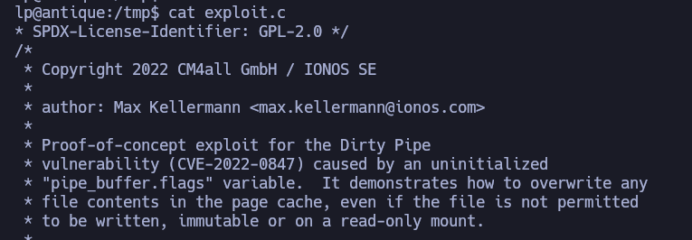

Así que con este archivo en **C**, lo compilamos:


Y pa' dentro: 

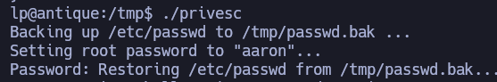

Ahora siendo **root** del sistema, ya podemos ver la flag:

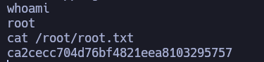


