-----------

Empezamos con la resolución de la máquina, haciendo un **ping** para comprobar si tenemos conexión:

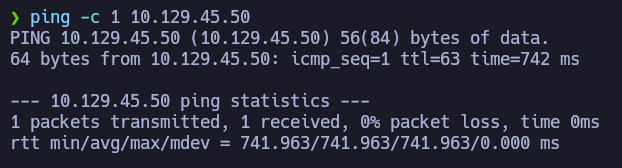

Podemos ver que hay conexión, enviamos un paquete y recibimos un paquete.

El siguiente paso es **escanear los puertos abiertos** de la máquina víctima para ver por donde podemos entrar, para ello usamos _nmap_ para primero hacer un escaneo sencillo:

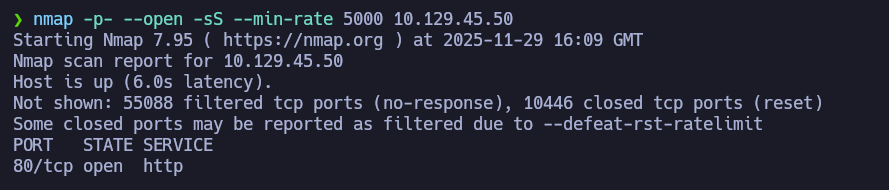

Solo hay un puerto abierto, el **puerto 80** y tiene abierto el servicio **http**, me imagino que habrá una web corriendo por detrás, pero antes de mirar la web, vamos a escanear este puerto en profundidad para ver si encontramos algo:


No tenemos apenas información útil, así que vamos a ver la web:


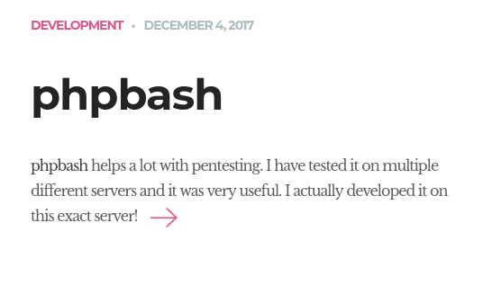

Parece ser que la web tiene algo llamado **phpbash** que según la web, nos sirve para hacer pentesting.

En la misma web encontramos esta imagen:

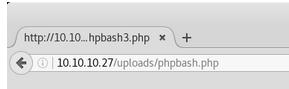

Se supone que en esta ruta encontraremos un archivo **.php** que nos daría una bash. 

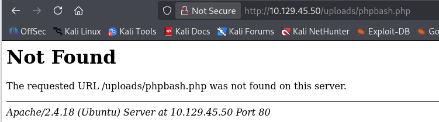

Decidí probar a ingresar a la URL, pero no encontré nada. 

Estaba seguro de que algo encontraría, así que probé a buscar archivos y/o directorios ocultos con **gobuster**: 


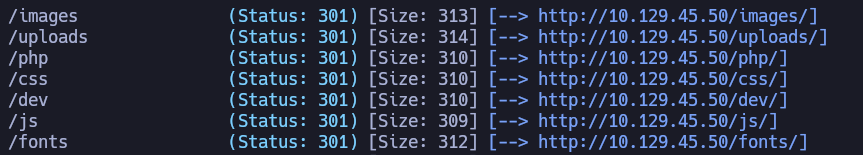

Encontré todos estos recursos ocultos, estuve mirando los recursos uno por uno y al final me quedé con el **/dev**:


Dentro de este recurso, encontré esto:

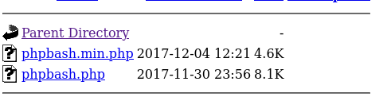

Al final si que había un archivo **phpbash**, al seleccionarlo, veremos esto:


El archivo nos ofrece una terminal directa en la web:

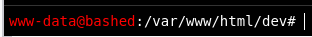

Ya de primeras, podemos ver que hay un usuario llamado **arrexel**: 

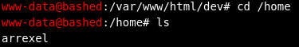

En este punto, me puse a hacer una reverse shell para usar la terminal desde la máquina Kali, para eso, primero me puse en escucha por un puerto:

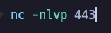

Luego, ejecuté este comando desde la terminal de la web: 

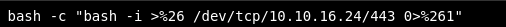

Ya estamos dentro de la web: 

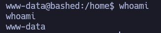

Una vez dentro hacemos el **tratamiento de la tty**, para que la terminal no explote: 

```bash
script /dev/null -c bash
ctrl+z
stty raw -echo; fg
reset xterm
export term=xterm
export shell=bash
```

Al tratado bien la tty, podemos ver la flag del usuario normal:

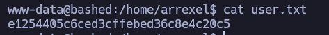

Podemos ver los permisos que tenemos en cuanto a ejecutar comandos con **sudo -l**: 

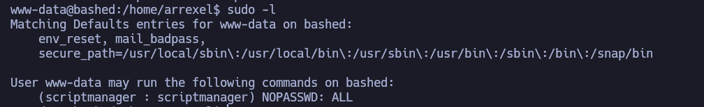

Podemos ejecutar cualquier comando dentro del usuario **scriptmanager**, así que con esto en mente, me puse una bash como este mismo usuario: 


Con este paso hecho, me puse a buscar archivos o binarios que pueda usar siendo **scriptmanager**, para ver si podía ejecutar algo con mayor permisos dentro del sistema:

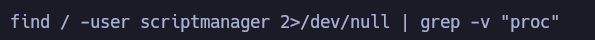

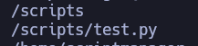

Encontré una carpeta llamada **/scripts** con un archivo de Python dentro, me dirigí a esa carpeta, y encontré todo esto:

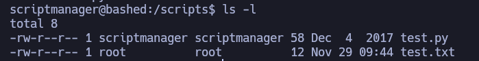

Siendo el usuario **scriptmanager** puedo modificar el archivo **test.py** y además hay otro archivo **test.txt** que solo root puede modificar.

Tras investigar por Internet, encontré esta lista de comandos que siendo ejecutados uno por uno, conseguimos la flag del root: 

```bash
echo import os > test.py
echo 'os.system("cat /root/root.txt > /tmp/flag4u.txt)' >> test.py
cat test.py
```

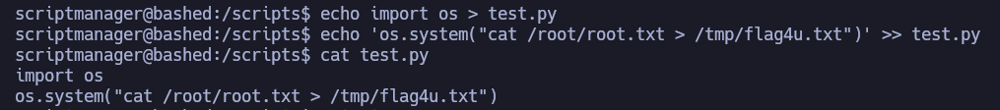

Simplemente usando Python para ingresar unos comandos a nivel de sistema para que se copie el contenido del archivo de la flag de root a un archivo dentro del directorio **/tmp**. 

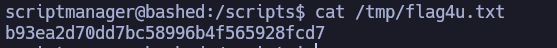


