-------------------

Empezamos con la resolución de la máquina, haciendo un **ping** para comprobar si tenemos conexión:

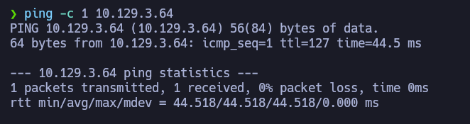

Podemos ver que hay conexión, enviamos un paquete y recibimos un paquete.

El siguiente paso es **escanear los puertos abiertos** de la máquina víctima para ver por donde podemos entrar, para ello usamos _nmap_ para primero hacer un escaneo sencillo:

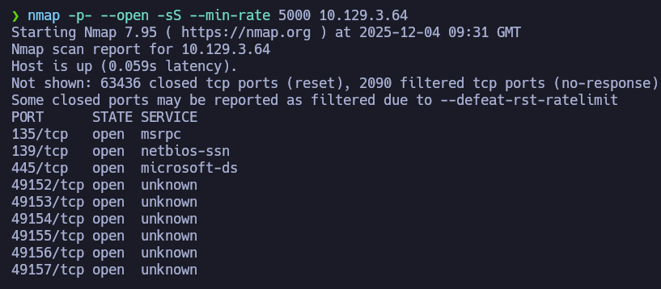

Encontramos todos estos puertos abiertos, el más llamativo es el **puerto 445**, en este caso esta máquina es vulnerable al *Eternal Blue*:

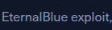

En esta situación, usaremos el **Metasploit** para resolver la máquina:

Para lanzar el **Metasploit** usamos el comando: 

Si buscamos la vulnerabilidad *Eternal Blue* en la base de datos, veremos esto:

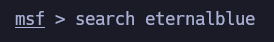

Encontraremos varios ejemplos y tipos de la misma vulnerabilidad, pero en este caso, elegimos el primer ejemplo:

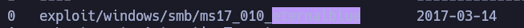

Para seleccionar un exploit, usamos su índice, en este caso el índice es 0:

Ahora debemos configurarlo a un nivel básico para que no pueda funcionar al momento de lanzar el exploit, para eso usamos este comando:

Debemos configurar la **dirección IP** de la máquina víctima y **dirección IP** de nuestra máquina atacante:

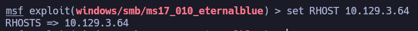

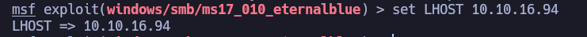

Al ya tener todo esto configurado, podemos lanzar el exploit, usando este comando:

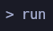

Recibiremos una sesión de **Meterpreter**, pero podemos obtener una terminal si ejecutamos el comando:

Ya podemos ver que recibimos una terminal siendo **Administrador** del sistema Windows:

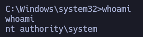

Con estos permisos dentro del sistema, ya podemos ver las flags de la máquina: 

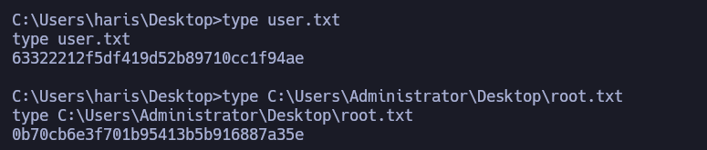

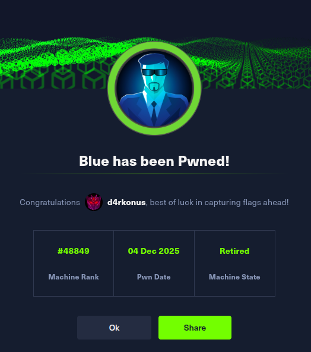