--------

Empezamos con la resolución de la máquina, haciendo un **ping** para comprobar si tenemos conexión:

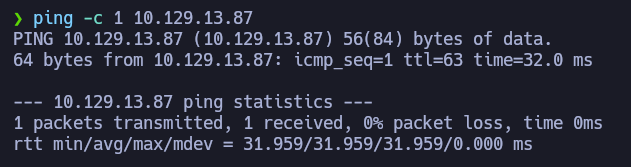

Podemos ver que hay conexión, enviamos un paquete y recibimos un paquete.

El siguiente paso es **escanear los puertos abiertos** de la máquina víctima para ver por donde podemos entrar, para ello usamos _nmap_ para primero hacer un escaneo sencillo:

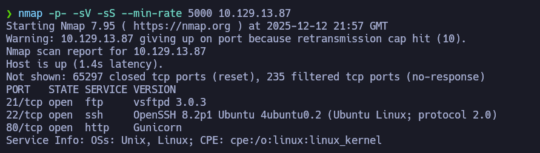

Podemos ver que hay **3 puertos abiertos** y me llama mucho la atención que los servicios *ssh* y *ftp* se encuentran activos ya que podríamos usarlos para acceder a la máquina o transferir archivos. 

Para tener más información de los puertos abiertos, decidí hacer otro escaneo con más profundidad:

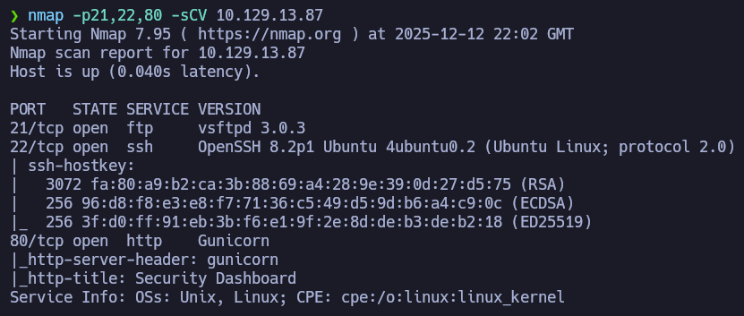

Como no encontré nada útil, al menos a primera vista, decidí copiar la IP de la máquina víctima en el navegador para ver a donde lleva:


Al acceder a la web, veremos esto:

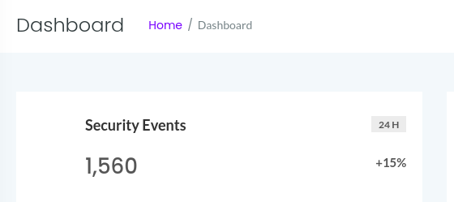

En una esquina podremos ver que somos el usuario **Nathan**:


Podremos ver este panel de las diferentes secciones que tiene la web, parece ser que la web está relacionada con la seguridad de paquetes a nivel de red (o algo así xd):

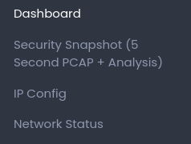

Si elegimos la opción de **Security Snapshot** veremos esto:

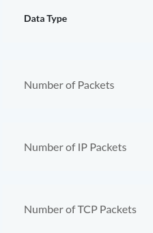

Parece ser una captura de seguridad que indican el número de paquetes capturados, además del tipo de paquete.

Y un detalle curioso es que al cambiar de sección de la web, la *URL* cambia y se incluye un número al final de la misma. 


También sucede que si el número cambia siendo su valor superior a **1**, el número de paquetes no cambia o apenas aumenta su contenido:

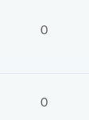

Lo que hice para proceder con la resolución de la máquina fue aprovechar un ***IDOR*** para cambiar el número del ID a **0**, en teoría no tendríamos que tener permisos para hacerlo, pero decidí intentarlo de todas formas: 


No solo funcionó sino que además apareció una captura de paquetes diferente y con muy buena pinta: 


La web nos permite descargar la captura:


Cuando tengamos el archivo descargado, podemos analizarlo con **Wireshark** ya que contiene datos de paquetes a nivel de red:

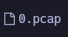


De primeras, nos encontramos con puro relleno que no tiene nada útil:

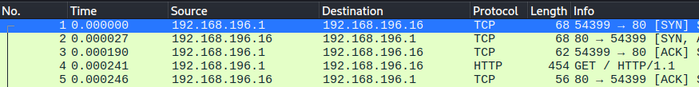

Pero analizando mejor el contenido, veremos una captura que muestra al usuario **Nathan** tratando de iniciar sesión en la máquina, y tenemos la contraseña en texto plano en la propia captura:

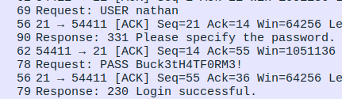

Con las credenciales en mano, ya podemos iniciar sesión con este comando:

```bash
ssh nathan@10.129.13.87
```

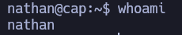

Para evitar que la terminal reviente, ejecutamos estos comandos:

```bash
export SHELL=bash
export TERM=xterm
```


Ahora siendo usuario del sistema, podemos ver la primera flag:

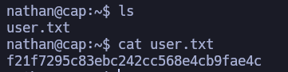

Nos queda la parte de escalar privilegios, así que me puse a buscar archivos con permisos SUID:

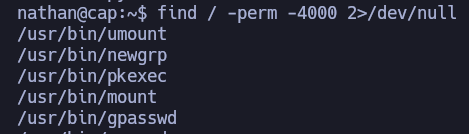

No encontré nada, así que me dio por buscar si la máquina tiene **Python** instalado:

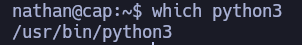

Y confirmo que **Python** estaba instalado en la máquina, traté de usar **Python** para escalar privilegios de esta forma: 

- Lo primero es ejecutar el intérprete usando la ruta absoluta:


- Una vez dentro importamos la librería *os* para interactuar con el sistema operativo, lo siguiente es establecer nuestro *id de usuario* a *0* que corresponde al usuario root, y por último nos lanzamos una bash: 

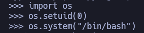

Ahora, ya somos usuario root del sistema:

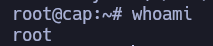

Aquí tenemos la última flag: 

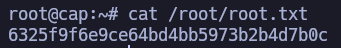

