---------

Empezamos con la resolución de la máquina, haciendo un **ping** para comprobar si tenemos conexión:


Podemos ver que hay conexión, enviamos un paquete y recibimos un paquete.

El siguiente paso es **escanear los puertos abiertos** de la máquina víctima para ver por donde podemos entrar, para ello usamos _nmap_ para primero hacer un escaneo sencillo:


Podemos ver que los puertos abiertos son los **puertos 22 y 5000** que tienen los servicios **ssh y upnp**.

Me pareció extraño que no hubieran mas puertos, de todas formas, probé un escaneo más profundo sobre los puertos abiertos que tenemos:


Parece ser que el **puerto 5000** tiene el servicio **http** abierto, aunque no termino de entender porque en el otro escaneo tenía otro servicio asignado.

En este punto, puse la IP junto con el puerto de la máquina víctima en el navegador para ver a donde lleva:

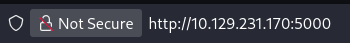

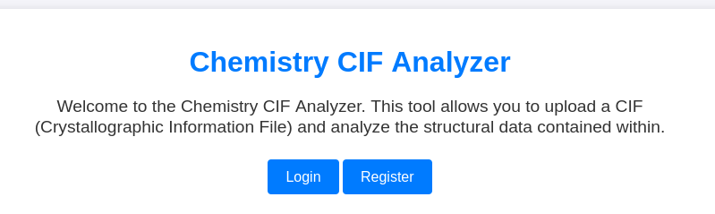

La web permite analizar archivos **.CIF**, y en esta parte podemos iniciar sesión o crear un usuario, así que nos creamos un nuevo usuario:

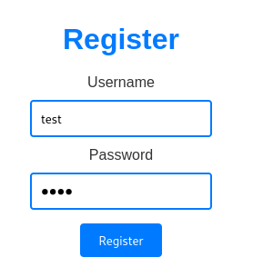

Al ingresar con credenciales, podemos ver que tenemos un panel para subir archivos a la máquina, pero solo pueden ser **.CIF**: 

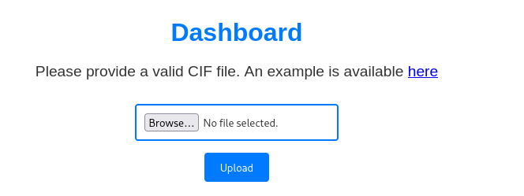

Podemos buscar en Internet por ejemplos de **archivos .CIF maliciosos** para poder seguir con la resolución de la máquina:

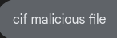

Podemos usar este repositorio como ejemplo:

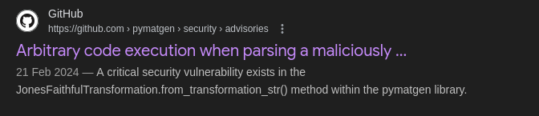

Podremos ver este código que es el que usaremos:


El archivo contiene información tipo **CIF** que es un formato de datos usado en cristalografía, sin embargo hay una expresión de Python metida como texto, podemos usar este código de Python para seguir con la resolución: 


Podemos ver que el código usa la librería **os** para poder crear un archivo *pwned* , pero lo cambiaremos para que lance una reverse shell: 


***Nota: tuve problemas al momento de lanzar la reverse shell con la instrucción de arriba, la solución que encontré fue en poner la ruta absoluta en las 2 veces que se aparece 'bash'***

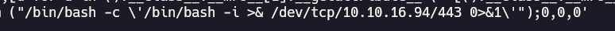

Nos ponemos en escucha por el puerto que usaremos para recibir la reverse shell: 


Y para recibir la shell, subimos el archivo modificado a la web: 

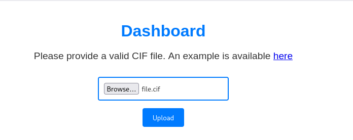

Ya estamos dentro: 

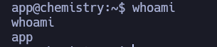

Una vez dentro, hacemos un **tratamiento de la tty**: 

```bash
script /dev/null -c bash
ctrl+z
stty raw -echo; fg
reset xterm
```

También cambiamos las dimensiones de la terminal, para que no se corte el texto:

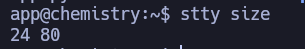


En este punto estuve mirando el contenido del directorio actual, y encontré esto:


Hay un archivo **app.py** que solo el usuario actual puede usar, y entre todo el contenido que tiene, destacó esto: 


Parece ser que hay un archivos de  base de datos que usa **sqlite**, quise ver la ruta absoluta del archivo:


Aquí podemos ver que el archivo usa **SQlite 3**:


Podemos ver el contenido de la base de datos ya que la máquina tiene instalado **SQlite 3**:

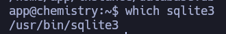

Con  esto en mente, vamos a ver que encontramos dentro:


Una vez dentro, filtramos por las bases de datos:


Hay una tabla **user** que seguramente contiene las credenciales de los usuarios:


Hay unos 15 nombres de usuario junto con sus hashes de contraseñas, en este punto usé la web **Crackstation.net** para sacar la contraseñas en texto plano, pero primero tenemos que quedarnos solo con los hashes:


Ahora sí, vamos a la web y ahí pegamos los hashes: 


Aunque son bastantes hashes, solo se pudieron sacar algunas contraseñas:

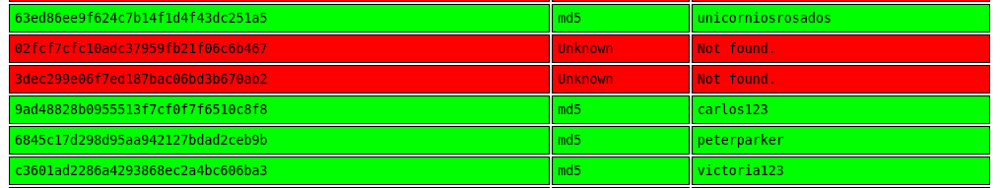

Estuve viendo los usuarios en el equipo para relacionarlos con las contraseñas, y pude ver que el usuario **rosa** puede tener la contraseña **unicorniosrosados**. 

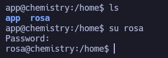

Pues la contraseña funciona, ahora siendo el usuario **rosa**, ya podemos ver la flag: 


Ahora solo falta obtener la flag del usuario **root** del sistema, estuve probando diferentes métodos entre repositorios de Github, hasta que me dió por probar un **directory path traversal** usando curl en el propio localhost de la máquina: 

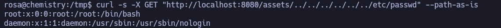

***Nota: el '--path-as-is' se añade para que el path no sea modificado de ninguna forma y se mande tal cual.***

En este ejemplo como prueba, apuntaba al **/etc/passwd** y podemos ver el contenido del archivo, ahora lo probé con la ruta de la flag del usuario **root**: 

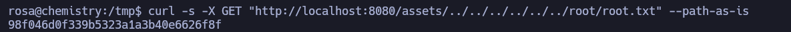

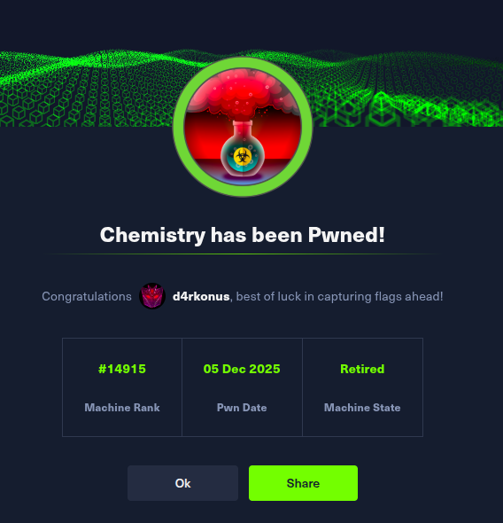