Empezamos con la resolución de la máquina, haciendo un **ping** para comprobar si tenemos conexión:

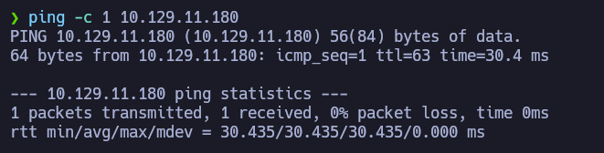

Podemos ver que hay conexión, enviamos un paquete y recibimos un paquete.

El siguiente paso es **escanear los puertos abiertos** de la máquina víctima para ver por donde podemos entrar, para ello usamos _nmap_ para primero hacer un escaneo sencillo:

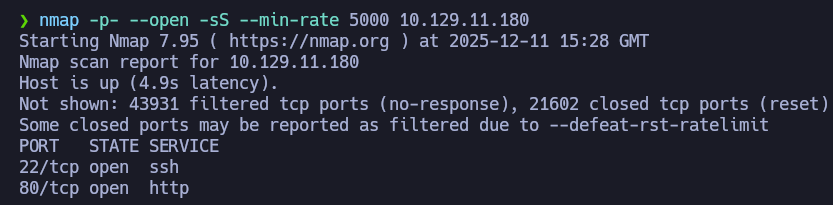

Ya veo que hay solo **2 puertos abiertos** y son los 2 que más me gustan ya que el **puerto 80** corresponde al *http* y el **puerto 22** corresponde al *ssh*, es decir, hay una página web corriendo por detrás de la máquina y posiblemente podamos conectarnos de algún modo con la máquina usando **ssh**. 

Lo siguiente es escanear los puertos en más profundidad para ver si tienen datos que nos puedan servir de algo:

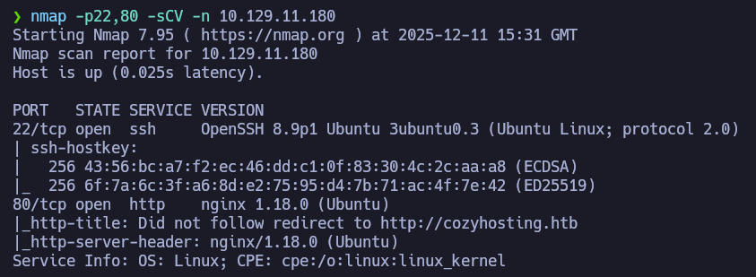

Ya podemos ver un dominio nuevo ***cozyhosting.htb***, antes de incluirlo al archivo */etc/hosts* quise probar a acceder a él, solo por ver que si resolvía bien: 

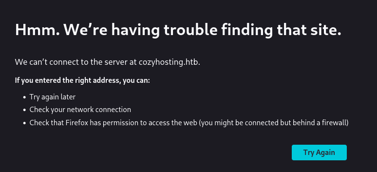

Como pensaba, no resuelve a nada, para resolver esto hay que añadir el dominio al archivo */etc/hosts*: 

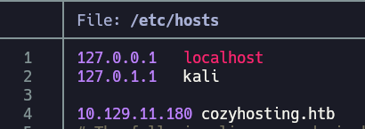

Ahora sí, podemos ver el contenido de la web:


Parece ser algún tipo de hosting para empresas, si nos fijamos bien, veremos que hay una sección de **login**: 


Estuve probando con credenciales típicas y comunes, pero no funcionaron: 

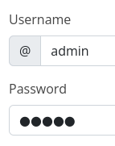

Me dió por buscar por contenido oculto en la web con **gobuster**, a ver si lograba cazar algo: 


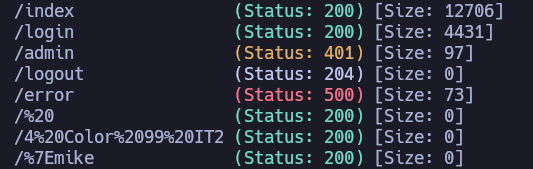

No encontré nada que mereciera la pena, pero intenté buscar por la sección de ***registro*** de la web ya que no la pude ver con **gobuster**: 


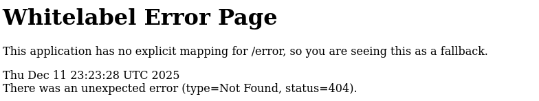

Al buscarla, me saltó este error, y como no tenía ni puta idea de que era, busqué información al respecto: 

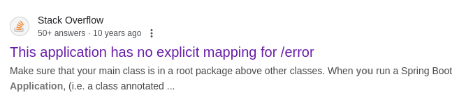

Encontré esta publicación de Stack Overflow que habla sobre el error: 

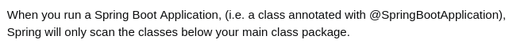

Menciona algo llamado **Spring Boot Application**, lo primero que encontré fue esto: 

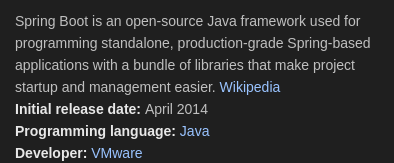

Un detalle que puede ser importante es que se habla del lenguaje **Java**, por ahora no es relevante pero puede serlo más adelante. 

Encontré este diccionario en **SecLists** que tiene contenido relacionado con el **Spring Boot**, y me dio por probar otra vez a buscar contenido oculto con **gobuster**: 


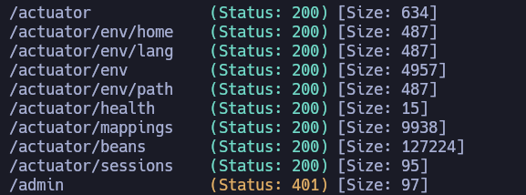

Todo este contenido es nuevo y podemos acceder a todo (en teoría), estuve mirando uno por uno para ver que encontraba: 


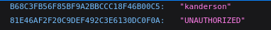

En el apartado de **sessions** encontré esto que parecen ser *cookies de sesión de usuarios*, esto me gusta verlo porque podremos hacer un robo de cookies de sesión para acceder a la web como un usuario propio sin tener que dar credenciales.

Para inyectar esta cookie, cree un inicio sesión con credenciales de prueba: 

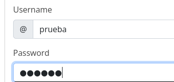

Ninguna de estas credenciales es válida, porque lo que busco modificar no es esto, sino esto: 

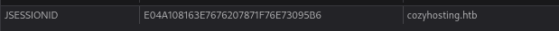

Esta cookie que vemos, la cambiamos por la que vimos anteriormente: 

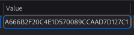

Y al recargar la página, veremos esto: 

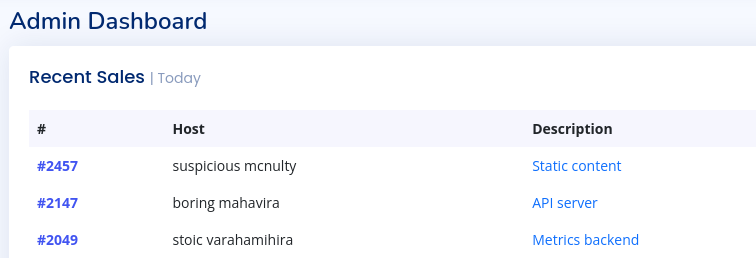

Podemos ver tanto el contenido como el usuario con el que ingresamos: 


En esta misma sección de la web, encontramos esto: 


Es un panel para ingresar datos de un equipo con el que poder conectarse de alguna manera, probé a ingresar la IP de mi máquina atacante y nombre de usuario *kanderson*: 


Me puse en escucha por el **puerto 22** y ví esto: 

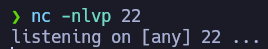

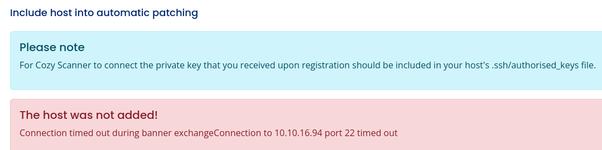

Parece ser que la máquina víctima trata de conectarse por **SSH** con la máquina atacante, pero la conexión no se completa. 

Una característica que se destaca por la máquina es la ***inyección de comandos***: 

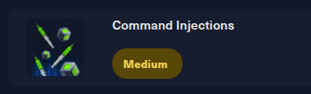

Decidí probar otro tipo de solicitudes y probé esto: 

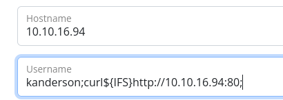

Acompañe el usuario *kanderson* con un comando con **curl** para hacer una petición a la máquina atacante por el puerto 80, en medio de la instrucción está **${IFS}** esto se conoce como **"Internal FIle Separator"**, su función es poner espacios entre texto que no se puede enviar con espacios visibles, gracias a esto podremos poner espacios en donde no se puede para que al enviar peticiones no nos devuelvan errores por sintaxis. 

Para recibir esa petición, nos abrimos un servidor temporal con Python: 


Y funciona: 


Si la petición ha funciona, probaremos con una **reverse shell**, empezamos creando el código de shell en un archivo ***index.html***: 

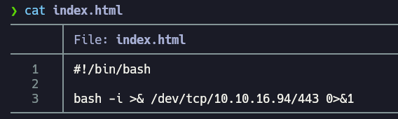

Este archivo lo moví a una ruta en concreto del sistema: 

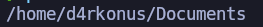

Volví a poner un servidor con Python: 


Y me hice una petición con a mi mismo equipo, todo dentro de una misma ruta del sistema: 


Podemos ver que el **curl** busca el archivo ***index.html*** que tiene el código en bash para la reverse shell. 

Modificamos la instrucción de la web por esta misma: 

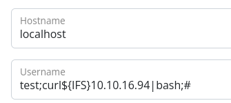

Si nos ponemos en escucha por el puerto dentro del código, recibiremos la reverse shell:

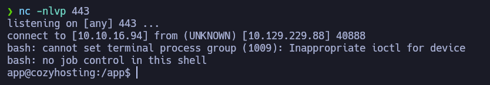

Una vez dentro, hacemos un **tratamiento de la tty** para que la terminal que tengamos no explote: 

```bash
script /dev/null -c bash
ctrl +z
stty raw -echo;fg
reset xterm
export SHELL=bash
export TERM=xterm
```

Una vez dentro, podemos ver el directorio del usuario no privilegiado del sistema, pero no podemos entrar (aún): 

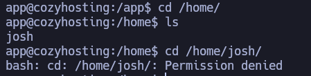

Estuve buscando archivos con permisos **SUID**, pero no encontré nada útil: 

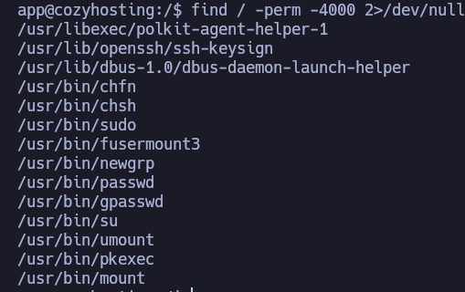


Hay un archivo en el directorio **/app**, y le saqué todo el contenido en la ruta ***'/tmp/app'*** :

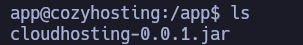


Aquí podemos ver el contenido principal:

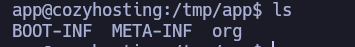

Estuve mirando los archivos y carpetas y terminé en este punto: 

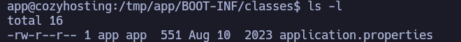

En este archivo encontré credenciales importantes para resolver la máquina: 

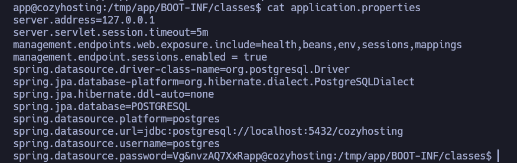

Parece ser que la máquina tiene una base de datos **PostgreSQL**,, además de que podemos ver credenciales para acceder a la base de datos, tanto el usuario como la contraseña.

Accedemos a la base de datos con las credenciales: 


Lo primero es listar el contenido principal de la base de datos: 

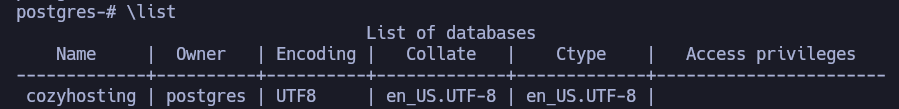

Hay una base de datos llamada **cozyhosting**, para acceder, usamos este comando: 


Al listar las tablas, veremos esto: 

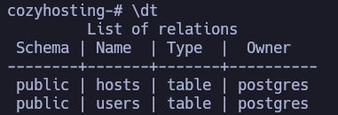

Listamos todo el contenido de la tabla **users**: 

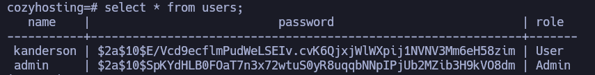

Podemos ver hashes de contraseñas, esto es muy bueno porque podremos sacar la contraseña en texto plano. 

Nos copiamos el hash del usuario **admin** en un archivo local de la máquina atacante: 

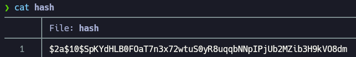

Ahora usamos **JohnTheRipper** para sacar la contraseña: 

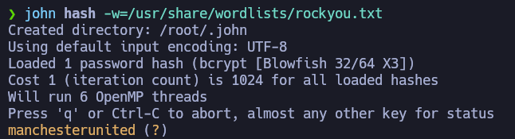

Ya con la contraseña en texto plano, podremos ingresar como usuario propio de la máquina, aunque antes revisé si los usuarios tienen una bash como shell por defecto: 

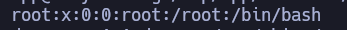

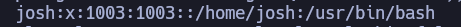

Encontré un nuevo usuario llamado **Josh** que tiene la bash por defecto, al igual que root.

Usé la contraseña anterior para ingresar como **Josh** y funcionó: 

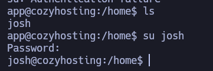

En este punto, ya podemos ver la primera flag: 

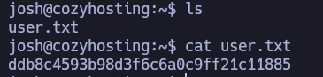

Para escalar privilegios, estuve mirando por comandos que se pueden ejecutar como sudo, sin ser sudo: 

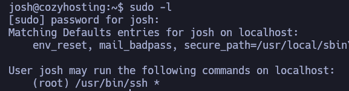

Parece ser que el binario de **ssh** tiene permisos de ser ejecutado como root del sistema, encontré un comando que nos puede servir para ser root usando **ssh**: 


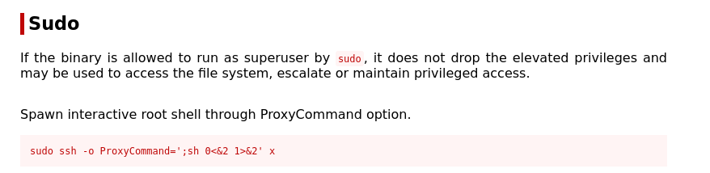

Simplemente ejecutamos este comando tal cual y ya seremos root del sistema: 

```bash
sudo ssh -o ProxyCommand=';sh 0<&2 1>&2' x
```

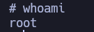

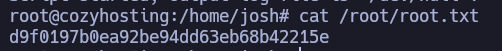

